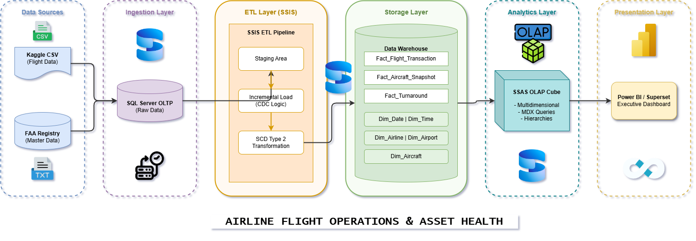

# Airline Flight Operations & Asset Health Data Warehouse

This project implements a comprehensive Data Warehouse (DWH) system designed to analyze U.S. domestic flight performance integrated with technical aircraft registration data. By combining transactional flight data with the FAA Aircraft Registry, the system provides a 360-degree view of operational efficiency, financial impacts of delays, and asset maintenance lifecycles.



## 📌 Project Overview

The aviation industry incurs billions of dollars in losses annually due to flight delays and cancellations. This project moves beyond simple descriptive statistics by implementing a multidimensional model that correlates flight logs with aircraft age, engine types, and manufacturer data.

### Key Business Objectives:

* **Operational Excellence:** Evaluate On-Time Performance (OTP) and identify airport bottlenecks.

* **Financial Impact:** Quantify estimated revenue loss based on delay duration and cancellation rates.

* **Asset Health & Maintenance:** Analyze the correlation between aircraft age/flight hours and technical incident frequency.

* **Ground Operation Efficiency:** Measure turnaround time performance at major hubs.

## 🏗 System Architecture

The system follows the **Kimball Lifecycle** methodology, utilizing a robust ETL pipeline:

1. **Data Sources:** CSV datasets (Kaggle 2015 Flights) & FAA Registry (Master Data).

2. **OLTP Layer:** Initial data ingestion into a relational MS SQL Server database.

3. **Staging Area:** Data cleaning, type casting, and structural normalization.

4. **Data Warehouse (DWH):** Multidimensional Star Schema with surrogate keys.

5. **OLAP Cube (SSAS):** Multidimensional cubes for high-performance analytical querying.

6. **Visualization (Power BI):** Executive dashboards for decision support.

## 📊 Dimensional Modeling

The project utilizes a **Star Schema** with Conformed Dimensions to ensure consistency across all Fact tables.

### Dimensions:

* **Dim_Date & Dim_Time:** Hierarchical time dimensions (Year > Quarter > Month > Day).

* **Dim_Airport:** Geographic hierarchy (State > City > Airport). **(SCD Type 1)**.

* **Dim_Airline:** Carrier identification and categorization. **(SCD Type 1)**.

* **Dim_Aircraft:** Detailed technical specifications (Manufacturer, Model, Engine Type). **(SCD Type 2)** to track historical changes in engine upgrades or ownership.

### Fact Tables:

1. **Fact_Flight_Transaction:** (Transaction Fact) Records every individual flight leg and its associated delays.

2. **Fact_Aircraft_Daily_Snapshot:** (Periodic Snapshot) Aggregates daily usage, flight cycles, and technical incidents per aircraft.

3. **Fact_Turnaround_Efficiency:** (Accumulating Snapshot) Tracks the ground time between a flight’s arrival and its next departure.

## ⚙ ETL Strategy (SSIS)

The ETL process is built using **SQL Server Integration Services (SSIS)** with a focus on performance and reliability:

* **Incremental Loading:** Implemented via a `Watermark` table logic. The system only extracts records where `Updated_Date > Last_Load_Date`.

* **Data Quality:** Automated handling of NULL values, trimming trailing spaces from FAA data, and standardizing time formats (Float to HH:MM).

* **SCD Logic:** Built-in SCD components to manage historical tracking for the Aircraft dimension.

* **Advanced SQL:** Utilized Window Functions (`LAG()`) in the staging phase to calculate turnaround durations.

## 🧠 Analysis & Insights (SSAS & MDX)

The **SSAS Multidimensional Cube** allows for complex analytical queries using **MDX**:

* **Financial Loss Analysis:** Identifying the highest-cost routes and carriers due to technical delays.

* **Maintenance Correlation:** Proving the relationship between aircraft age bands and the frequency of "Carrier Delays."

* **Hub Efficiency:** Ranking airports by "Turnaround Variance" to pinpoint operational bottlenecks.

## 🚀 Tech Stack

* **Database:** Microsoft SQL Server 2019/2022

* **ETL:** SQL Server Integration Services (SSIS)

* **OLAP:** SQL Server Analysis Services (SSAS)

* **BI & Viz:** Microsoft Power BI Desktop

* **Design Tools:** Kimball Dimensional Modeling Workbooks (High-Level & Detailed)

## 📁 Repository Structure

```text
.
├── Dashboard/              # Power BI reports and visualizations
├── Data/                   # Raw datasets (Not tracked in Git, manually placed)
│   ├── 2015-flight-delays-and-cancellations/
│   │   ├── airlines.csv
│   │   ├── airports.csv
│   │   └── flights.csv
│   └── faa-aircraft-registry/
│       ├── ACFTREF.txt
│       ├── MASTER.txt
│       └── ardata.pdf
├── Docs/                   # Project documentation and architecture diagrams
├── SQL_Script/             # DDL/DML scripts for OLTP and DWH layers
├── SSAS_Cube/              # Analysis Services project files
├── SSIS_Package/           # Integration Services ETL packages
└── README.md
```

## 📥 Data Preparation

To run this project, you need to download the datasets and place them in the correct directory.

### 1. Download Links:
*   **Main Dataset (2015 Flights):** [Kaggle - 2015 Flight Delays and Cancellations](https://www.kaggle.com/datasets/usdot/flight-delays)
*   **Asset Registry (FAA):** [FAA - Releasable Aircraft Download](https://www.faa.gov/licenses_certificates/aircraft_certification/aircraft_registry/releasable_aircraft_download)

### 2. Manual Placement Instruction:
Extract and place the downloaded files into the following directories:

*   **Flight Data:** `Data/2015-flight-delays-and-cancellations/`
    *   `airlines.csv`
    *   `airports.csv`
    *   `flights.csv`
*   **FAA Registry:** `Data/faa-aircraft-registry/`
    *   `ACFTREF.txt`
    *   `MASTER.txt`
    *   `ardata.pdf`


## 👥 Team Contribution

This project was developed following **Scrum** principles across 4 Sprints (Cycles):

* **Member A:** Project Lead, ETL Architecture, Fact_Flight_Transaction, SCD Type 2 Logic.

* **Member B:** DB Administration, Incremental Load Implementation, Power BI Dashboard Design.

* **Member C:** SSAS Cube Design, MDX Query Development, Fact_Turnaround logic (SQL Advanced).
